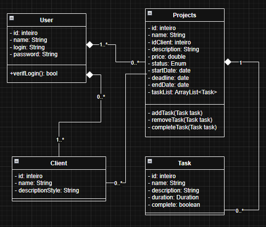

# Gerenciador de Projetos Freelance

Um projeto backend desenvolvido em **Java** para gerenciar projetos e suas especificações.

O objetivo deste projeto é simular um sistema real usado por freelancers para organizar seu trabalho e acompanhar o progresso dos projetos.

Este repositório faz parte de uma **jornada de aprendizado**, onde o sistema evoluirá à medida que eu for aprendendo novas coisas.

Versões futuras incluirão persistência de banco de dados, APIs REST e uma interface de usuário.

---

## Objetivos do Projeto

Este projeto foi criado para praticar e demonstrar conhecimento em:

- Programação Orientada a Objetos (POO)
- Arquitetura de software
- Desenvolvimento de backend em Java
- Git e controle de versão
- Estrutura de projeto limpa
- Tratamento de exceções
- Modelagem de domínio

Objetivos futuros incluem:

- Desenvolvimento de API REST com **Spring Boot**
- Integração com banco de dados usando **JPA / Hibernate**
- Autenticação e autorização
- Frontend consumindo a API de backend

---

## Visão Geral do Sistema

O sistema permite que um freelancer gerencie:

- Projetos
- Clientes
- Tarefas dentro de cada projeto
- Progresso e status do projeto

Exemplo de fluxo de trabalho:

1. Um usuário cadastra um cliente
2. Um projeto é criado para esse cliente
3. Tarefas são adicionadas ao projeto
4. O projeto avança à medida que as tarefas são concluídas 
5. O status do projeto é atualizado de acordo

---

## Modelo de Domínio

Principais entidades do sistema:

- **User** – representa o freelancer que utiliza o sistema
- **Client** – representa um cliente freelancer
- **Project** – representa um projeto criado para um cliente
- **Task** – representa tarefas dentro de um projeto
- **Project Status** – enumeração que descreve os estados do projeto

Relacionamentos:
- 
---
